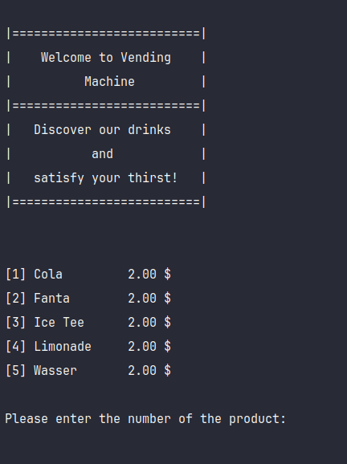
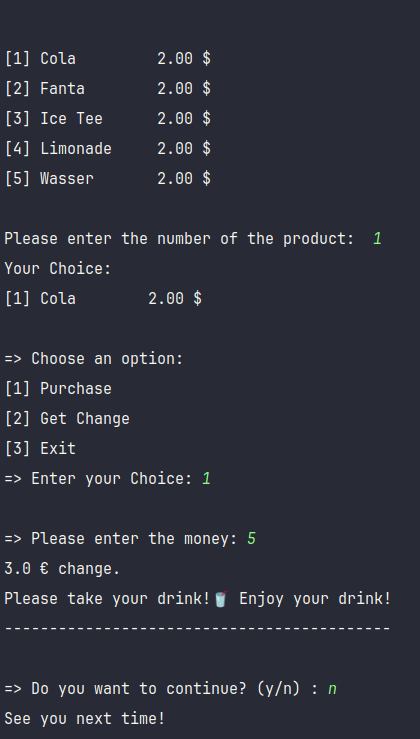

# Vending Machine

## Overview

This Java application simulates a simple vending machine that offers various drinks for purchase.

## App-Screenshot

## Features

- ** Product Selection:** Choose from a list of available drinks.
- ** Purchase:** Buy drinks by entering the required amount.
- ** Change Calculation:** Receive change if you insert more money than the drink price.
- ** Continuation:** Decide whether to continue using the vending machine after a transaction.

### Prerequisites

- Java JDK 21 or newer. Ensure you are using an LTS version for the best stability and support. For instance, version 21.0.2 as of October 17, 2023, is a good choice.

### Usage

- Menu:
The available drinks and their prices are displayed on the console.

- Product Selection:
Enter the number of the desired product.

- Purchase:
If purchasing, enter the required amount. The application will guide you through the process.

- Continuation:
After completing a transaction, decide whether to continue using the vending machine.

### Repository

[VendingMachine-Java GitHub Repository](https://github.com/mahboube89/VendingMachine-Java.git)
